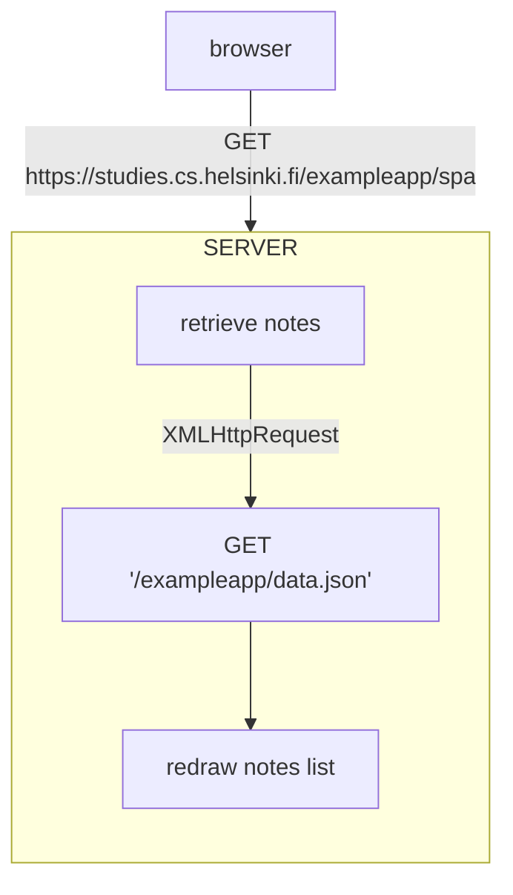

```mermaid
flowchart TD
A[browser]
    subgraph SERVER
    direction TB
        B[redraw notes list]
        C[retrieve notes]
        D[GET '/exampleapp/data.json']
        C-->|XMLHttpRequest|D
        D-->B
    end
    A-->|GET https://studies.cs.helsinki.fi/exampleapp/spa|SERVER
```